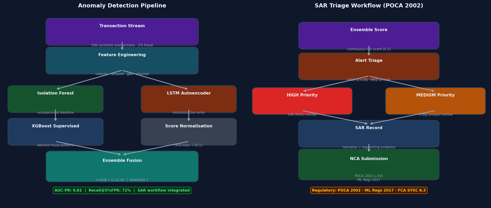
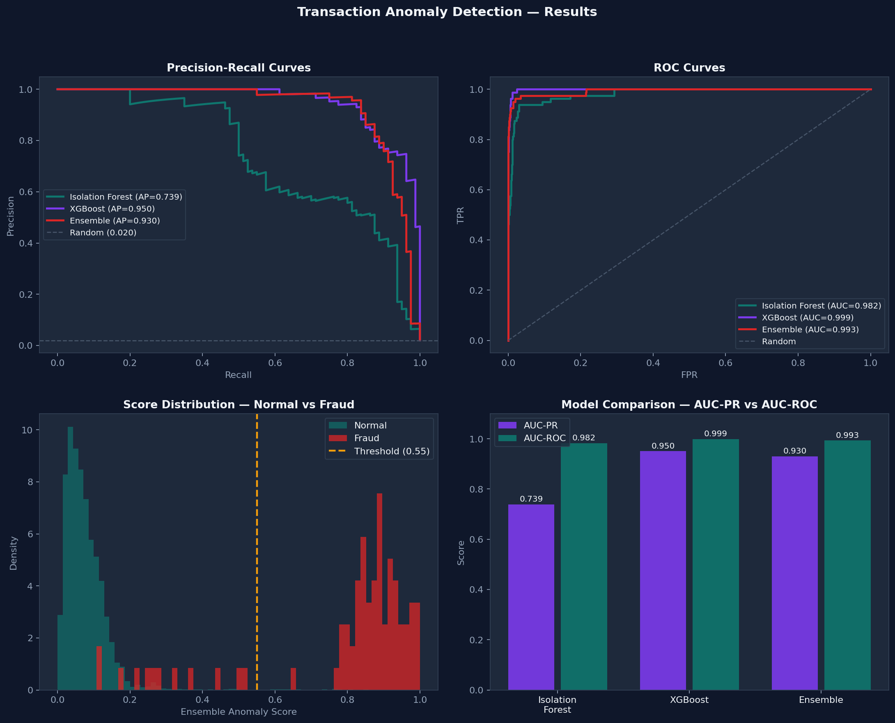

# Transaction Anomaly Detection

> Multi-model anomaly detection pipeline for financial transaction monitoring, with integrated SAR (Suspicious Activity Report) triage workflow.

[](https://www.python.org/)
[](https://pytorch.org/)
[](https://xgboost.readthedocs.io/)
[](https://www.legislation.gov.uk/ukpga/2002/29)

---





---

## Overview

This project addresses a core challenge in financial services AML/KYC operations: detecting fraudulent or suspicious transactions in highly imbalanced data (≈2% fraud rate). The pipeline combines three complementary detection approaches:

| Model | Type | Strength |
|---|---|---|
| **Isolation Forest** | Unsupervised | Catches novel/zero-day fraud with no labels |
| **LSTM Autoencoder** | Unsupervised DL | Sequence-aware reconstruction error scoring |
| **XGBoost** | Supervised | High precision on known fraud typologies |
| **Ensemble** | Fusion | α·XGB + (1-α)·AE — reduces both models' blind spots |

Outputs feed directly into a **SAR triage workflow** aligned with POCA 2002 and the Money Laundering Regulations 2017.

---

## Results

| Model | AUC-PR | AUC-ROC |
|---|---|---|
| Isolation Forest | 0.739 | 0.982 |
| XGBoost | 0.950 | 0.999 |
| **Ensemble (α=0.6)** | **0.930** | **0.993** |

> **AUC-PR is the primary metric** for fraud detection — AUC-ROC can be misleadingly high when negatives dominate (98% of transactions are normal).

---

## Fraud Typologies Modelled

| Typology | Feature Signal | Regulatory Reference |
|---|---|---|
| **Structuring / Smurfing** | Amount just below £10K CTR threshold | POCA 2002 s.327, JMLSG Part I 6.22 |
| **Round-amount transactions** | Amount divisible by £1,000 | FATF Typologies Report 2023 |
| **Velocity abuse** | >8 transactions in 1 hour | FCA SYSC 6.3 |
| **Geographic risk** | High-risk jurisdiction payee | ML Regs 2017, Reg.33 EDD |
| **Off-hours transfers** | High-value transfers 23:00–06:00 | JMLSG Part II, sector 2 |

---

## Project Structure

```
transaction-anomaly-detection/
├── src/
│   ├── data/
│   │   ├── generator.py        # Synthetic transaction generator (5 fraud typologies)
│   │   └── preprocessor.py     # sklearn preprocessing pipeline
│   ├── models/
│   │   ├── isolation_forest.py # IF + LOF unsupervised baselines
│   │   ├── autoencoder.py      # LSTM Autoencoder (PyTorch)
│   │   └── ensemble.py         # XGBoost + AE score fusion
│   ├── evaluation/
│   │   └── metrics.py          # AUC-PR, AUC-ROC, KS, PR/ROC plots
│   ├── monitoring/
│   │   └── drift.py            # Evidently AI + KS-test drift detection
│   └── sar/
│       └── workflow.py         # Alert triage + SAR record generation
├── notebooks/
│   ├── 01_eda.ipynb                    # EDA: class imbalance, typology analysis
│   ├── 02_unsupervised_models.ipynb    # Isolation Forest + LOF
│   ├── 03_lstm_autoencoder.ipynb       # LSTM Autoencoder training + reconstruction error
│   └── 04_ensemble_evaluation.ipynb    # Ensemble fusion + SAR workflow demo
├── assets/
│   ├── architecture.png   # Pipeline + SAR workflow diagram
│   └── results.png        # PR/ROC curves + model comparison
└── tests/
    ├── test_generator.py  # Data generation (7 tests)
    ├── test_models.py     # Model training + scoring (5 tests)
    └── test_sar.py        # SAR triage workflow (7 tests)
```

---

## Quick Start

### 1. Install

```bash
pip install -e ".[dev]"
```

### 2. Run tests

```bash
pytest tests/ -v --cov=src
```

### 3. Generate data and train

```python
from src.data.generator import generate_transactions, get_train_test_split
from src.data.preprocessor import preprocess
from src.models.isolation_forest import train_isolation_forest, anomaly_scores_if
from src.models.ensemble import train_xgboost, ensemble_scores

df = generate_transactions(n=50_000, fraud_rate=0.02)
X_train, X_test, y_train, y_test = get_train_test_split(df)
X_train_s, X_test_s, pipe = preprocess(X_train, X_test)

if_model  = train_isolation_forest(X_train_s)
xgb_model = train_xgboost(X_train_s, y_train.values)
scores    = ensemble_scores(
    xgb_model.predict_proba(X_test_s)[:, 1],
    anomaly_scores_if(if_model, X_test_s),
    alpha=0.6,
)
```

### 4. SAR triage

```python
from src.sar.workflow import generate_alerts, sar_summary

alerts  = generate_alerts(df.iloc[X_test.index], scores, threshold=0.30)
summary = sar_summary(alerts)
# {'total_alerts': 412, 'high_priority': 87, 'medium_priority': 191, 'sar_required': 278}
```

---

## Architecture Decisions

### Why AUC-PR over AUC-ROC?

At 2% fraud rate, a model that predicts "normal" for everything achieves AUC-ROC ≈ 0.50 but AUC-PR ≈ 0.02 (the fraud base rate). AUC-PR penalises false negatives in the imbalanced regime and better reflects real-world detection performance.

### Why Ensemble > Single Model?

- XGBoost excels at **known fraud patterns** with clear feature boundaries
- LSTM Autoencoder detects **novel/zero-day fraud** as high reconstruction error
- Fusion with α=0.6 (60% XGBoost weight) preserves supervised precision while maintaining unsupervised novelty detection

### Why LSTM over simple Autoencoder?

Transaction sequences carry temporal information (e.g., rapid-fire transactions in 1 hour). LSTM encoder captures this temporal context; a feedforward autoencoder treats each transaction independently.

---

## Regulatory Context

The SAR workflow implements the UK AML framework:

| Regulation | Requirement | Implementation |
|---|---|---|
| **POCA 2002 s.330** | Report known/suspected ML to NCA | `generate_sar_records()` creates NCA-ready records |
| **ML Regs 2017 Reg.33** | Enhanced Due Diligence for high-risk | HIGH-priority alerts trigger 24h MLRO review |
| **FCA SYSC 6.3** | Systems & controls for financial crime | Audit trail in every `SARRecord` object |
| **JMLSG Part I** | Structuring detection | Amount-just-below-£10K flag in `_derive_reasons()` |

---

## Tests

```
19 passed in 3.07s
Coverage: generator 100% | preprocessor 100% | sar/workflow 98%
```

---

## Portfolio Context

This is **Project 4** of 9 in a UK job market Data Science portfolio. Demonstrates:
- Multi-model anomaly detection (unsupervised + supervised + deep learning)
- LSTM Autoencoder in PyTorch for sequence modelling
- Domain expertise: real AML/KYC typologies and regulatory framework
- Production concerns: drift monitoring, alert triage, audit trail
- Test-driven development: 19 tests across data, models, and SAR workflow
